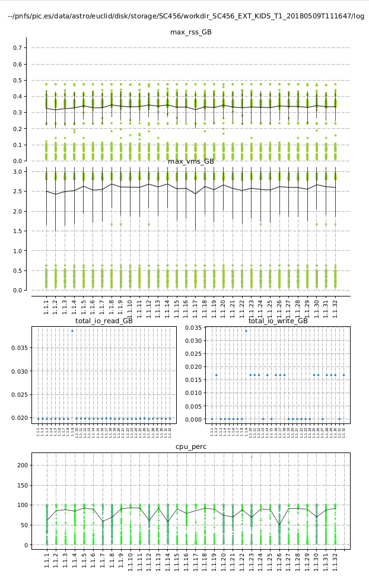
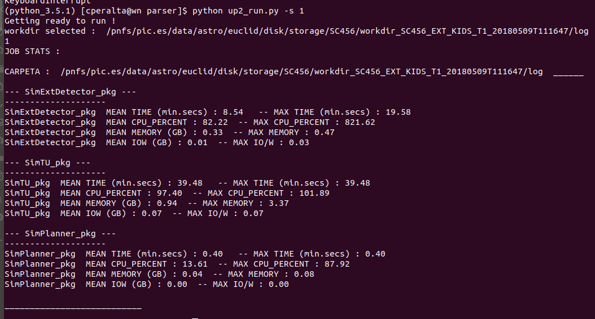

# Project Title


## Getting Started

There are 2 main scripts on this project. 

* **usageparser_run.py :** Provides an easy way to execute 
* **usage_parser.py :** Class used to parse the data from csv(s) inside one or more folders into plots or to get the mean/max stats per typer of job. 
	
There are 2 folders on the project: 

* conf : Stores the configuration file 
* plots : Stores the plots created by usageparser_run.py calls. 

Every argument that can be used on usageparser_run.py is explained below on "usageparser_run" paragraph.

# Configuration

Sample configuration file: 

```
[paths]
folder_path=/pnfs/pic.es/data/astro/euclid/disk/storage/SC456/
workdir_path=workdir_SC456_EXT_KIDS_T1_20180509T111647/log

[limits]
RAM=4
IOW=10

[jobs_info]
job_names=SimExtDetector_pkg,SimTU_pkg,SimPlanner_pkg
size_job=SimExtDetector_pkg

```

## paths settings 

* **folder_path :** path where the data folder will be found 
* **workdir_path :** path of the data folder 


## limits settings

* **RAM :** Memory limit (GB)
* **IOW :** IO writes limit (GB)

## jobs_info

* **job_names :** Name of the jobs to analize inside workdir_path folder. Must be separated by commas. 
* **size_job :** Name of the job that will be used to set the size of the plot. Its convenient that it is the type of job with more csv usage files. 


# Parsing the csv usage files 

First you must load the data from csv folder(s). 

```
parser = up.Usage_Parser2(whole_workdir,jobs,mem=memory_limit, wr=iow_limit)

parser.load_data(jobs, set_size_job)

```

Then you need to plot the provided data as shown below : 

```
parser.plot_all_jobs()

```
Once its done you'll find in the folder ./plot that a number of .pdf equal to the number of folders provided has been created. Inside of each .pdf there is the data of all the jobs contained on each folder classified per type of job. It should look like :




If you'd like to change the folder where plots are stored you should change the path shown as bold text below inside usage_parser.py/plot_all_jobs()

```
for d in self.data: 
	with PdfPages(('\*\*/nfs/pic.es/user/c/cperalta/python_envs/python_3.5.1/cosasAcabadas/parser/plots/\*\*'+d.parent_folder.split('/')[-2]+'.pdf')) as pdf:
```

# Getting job stats by folder

For every provided folder you can get (ordered by type of job) the mean and maximum of : 

* **Time spent** 
* **CPU % usage**
* **RSS (GB)**
* **IO writes (GB)**

To do so, first load the data from csv folder(s) as shown before and then call:

```
parser.get_job_stats()
```
Output should be similar to : 




# usageparser_run 

Everything is prepared to run by executing up_run.py. 

```
> python up_run.py -s -plt
```
Where: 

* **-s :** Shows the stats for the provided folder(s). 
* **-plt :** Saves into a pdf with the name of the folder the plots for each folder. 

Default value for both -s and -plt are True. 

There are also some other arguments that are not mandatory : 


* **-wdr :** Whole directory to the log folder containing usage files [example: /pnfs/pic.es/data/astro/euclid/disk/storage/SC456/workdir_SC456_EXT_KIDS_T1_\*\/log]
* **-j :** List separated by commas with the job names inside the folder(s) 
* **-size_job :** job that will be used to choose the amount of data displayed on the plots (default 62) 
* **-m :** Changes memory limit (GB)
* **-w :** Changes IO writes limit (GB)

If you would like to see all the available arguments '**-h**' will list them with plus how to use them. 


